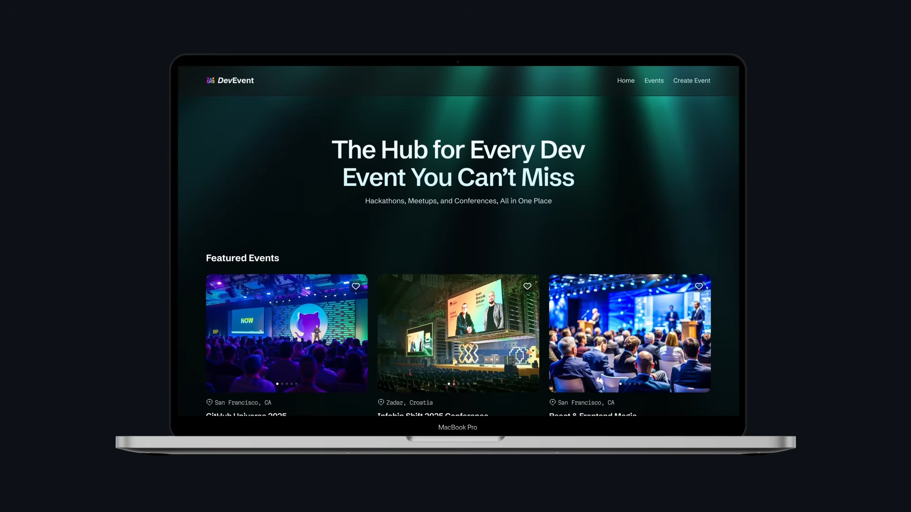

# DevEvent 🚀

DevEvent is a Next.js-based web platform to discover, share, and explore developer events from around the world.
It helps developers stay updated with hackathons, conferences, meetups, workshops, and online tech events across different domains.



### 🌍 What is DevEvent?

DevEvent is built for developers who want a single place to:
- Discover upcoming developer events worldwide
- Share events with the community
- Explore events by category, tech stack, or location
- Stay connected with the global developer ecosystem

Whether you're a student, professional, or tech enthusiast, DevEvent makes event discovery simple and organized.

---
### ✨ Features

🌐 Global developer event discovery <br> 
📅 Event listing with date, location, and type <br>
🔍 Search and filter events by category or tech stack <br>
🧑‍💻 Community-driven event sharing <br>
⚡ Fast and SEO-friendly Next.js architecture <br>
📱 Fully responsive design <br>

---
### 🛠️ Tech Stack

**Framework**: Next.js <br>
**Frontend**: React, HTML, CSS <br>
**Styling**: CSS / Tailwind (if applicable) <br>
**Backend**: API routes / External APIs (optional) <br>
**Database**: (Planned / Optional) <br>
**Deployment**: Vercel / Netlify <br>

---
### 🚀 Getting Started
1. Clone the repository
```
git clone https://github.com/your-username/DevEvent.git
cd DevEvent
```
2. Install dependencies
```
npm install
or
yarn install
```
3. Run the development server
```
npm run dev
# or
yarn dev
```

Open http://localhost:3000 in your browser to see the app.

---
### 🧪 Scripts

```npm run dev       # Start development server
npm run build     # Build for production
npm run start     # Start production server
npm run lint      # Run ESLint
```

---
### 🤝 Contributing

1. Contributions are welcome!
2. Fork the repo
3. Create your feature branch
4. Commit your changes
5. Push to the branch
6. Open a Pull Request

### 📄 License

This project is licensed under the MIT License.
Feel free to use, modify, and distribute.

### ⭐ Support

If you like this project, consider giving it a star ⭐
It helps the project grow and stay visible.

#### Made by Jass❤️